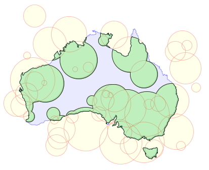

# ocaml-clipper2
OCaml bindings to the polygon clipping and offseting library Clipper2

# Clipper

OCaml bindings to the polygon clipping and offseting library [Clipper2](http://www.angusj.com/clipper2/Docs/Overview.htm)



## Documentation

Documentation is available [online](https://geoffder.github.io/ocaml-clipper2/clipper/index.html).

## Building

[clipper2c](https://github.com/geoffder/clipper2c) is vendored as a git
submodule, so make sure to add `--recurse-submodules` when cloning, or run
`git submodule update --init --recursive` to update the submodule if already cloned.

```
git clone --recurse-submodules https://github.com/geoffder/ocaml-clipper2
cd ocaml-clipper2
dune build
```
